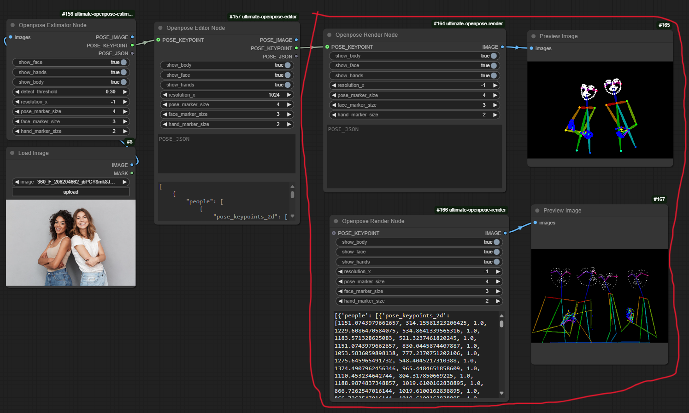

<div align="center">

# ComfyUI ultimate openpose render

</div>

<p align="center">
  
</p>

This is a better version of openpose pose render in ComfyUI with both pose keypoints and pose json input options. It also gives the plotting controls with canvas size and pose marker size.

If you like the project, please give me a star! ⭐

## Installation

- Just install this repo through the Manager. Or you can manually install it, go to ComfyUI `/custom_nodes` directory
    ```bash
    git clone https://github.com/westNeighbor/ComfyUI-ultimate-openpose-render
    cd ./ComfyUI-ultimate-openpose-render
    pip install -r requirements.txt # if you use portable version, see below
    ```
    if you use portable version, install requirement accordingly, for example, I have portable in my E: disk
    ```bash
    E:/ComfyUI_windows_portable/python_embeded/python.exe -m pip install -r requirements.txt
    ```
## Usage
- Insert node by `Right Click -> ultimate-openpose -> Openpose Render Node`

## Features
- Accept both pose keypoints and pose json format input. Be ware that the edit priority is **POSE\_KEYPOINT > POSE\_JSON** 

- Can adjust output canvas size

- Can control the pose marker size
